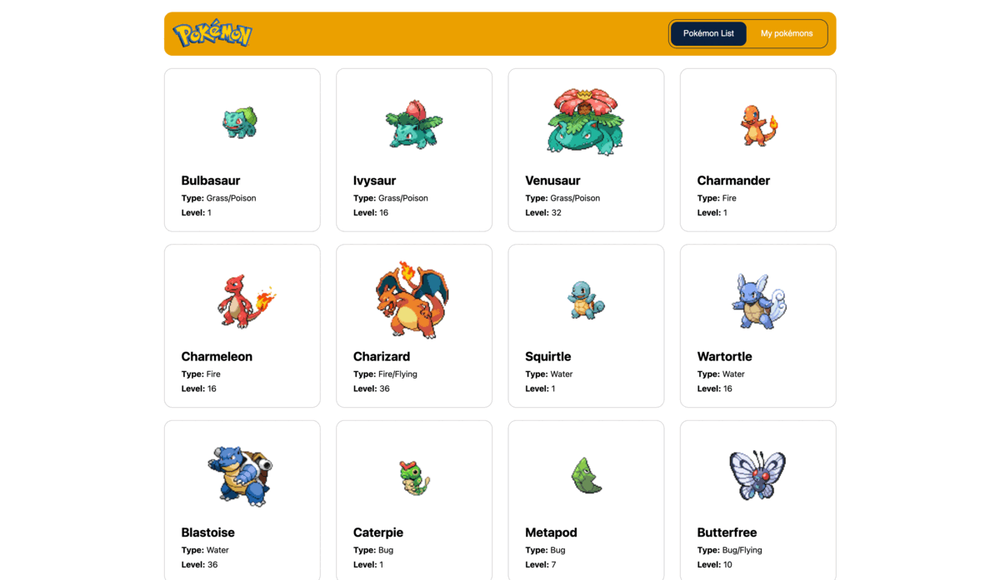

# 🐱 Front-end part of Pokemons app

## Table of contents

- [Overview](#overview)
  - [The challenge](#the-challenge)
  - [Screenshot](#screenshot)
  - [Links](#links)
- [My process](#my-process)
  - [Built with](#built-with)
  - [What I learned](#what-i-learned)
- [Author](#author)

## Overview

### The challenge

Users should be able to:

- Use their Metamask account to Add and Evolve Pokemons by signing specific message

### Screenshot

### Links

- [Solution URL](https://github.com/superpooperxxx/bitmedia__test-pokemons)
- [Live Site URL](https://superpooperxxx.github.io/bitmedia__test-pokemons/)

## My process

### Built with

  
  
  
  
  
  

Also: 
- ethers
- react-router-dom
- classnames

### What I learned

- The main focus was to learn how integrate Metamask into React app. How to authenticate user and his messages.

## Author

- Github - [superpooperxx](https://github.com/superpooperxxx)
- LinkedIn - [Kyrylo Haiduk](https://www.linkedin.com/in/kyrylo-haiduk/)
- Telegram - [@haidukwork](https://t.me/haidukwork)
- Frontend Mentor - [@superpooperxxx](https://www.frontendmentor.io/profile/superpooperxxx)
